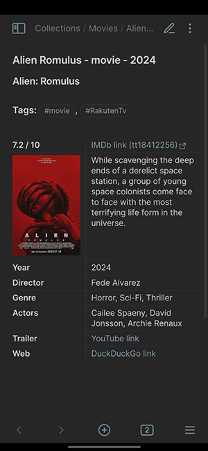

# OMDb movie data fetcher

This is a fork from the QuickAdd original _[movie.js](https://quickadd.obsidian.guide/assets/files/movies-86507f5b12922d1a3faca11b07d6b883.js)_ macro script.

# Changes
* More readable code
* Add linting and code formatting
* Remove extra template values (except fileName)
* Add IMDb url parsing support

# Usage
The usage is tha same like the original _movie.js_ macro. _[Documentation](https://quickadd.obsidian.guide/docs/Examples/Macro_MovieAndSeriesScript)_

When the _Installation_ steps ask you for the _movie.js_ selection, then you should select the _omdb-movie-data-fetcher.js_ script.

# Template

**Template file:** [Movie.template.md](Movie.template.md)

**Example:**

